# NITK-UsoundSim

**A modular 2-D ultrasound simulator: a tissue phantom goes in, a B-mode image comes out.**

Built by seven teams, one pipeline stage each, and integrated into one end-to-end simulator.
Probe: **Philips L12-4 (FUS4103) reference model**: 128-element linear array, 0.30 mm pitch, 8 MHz centre frequency (4–12 MHz range).

[](https://colab.research.google.com/github/darshilgmaniya/NITK-UsoundSim/blob/main/demo_colab.ipynb)

<p align="center">
  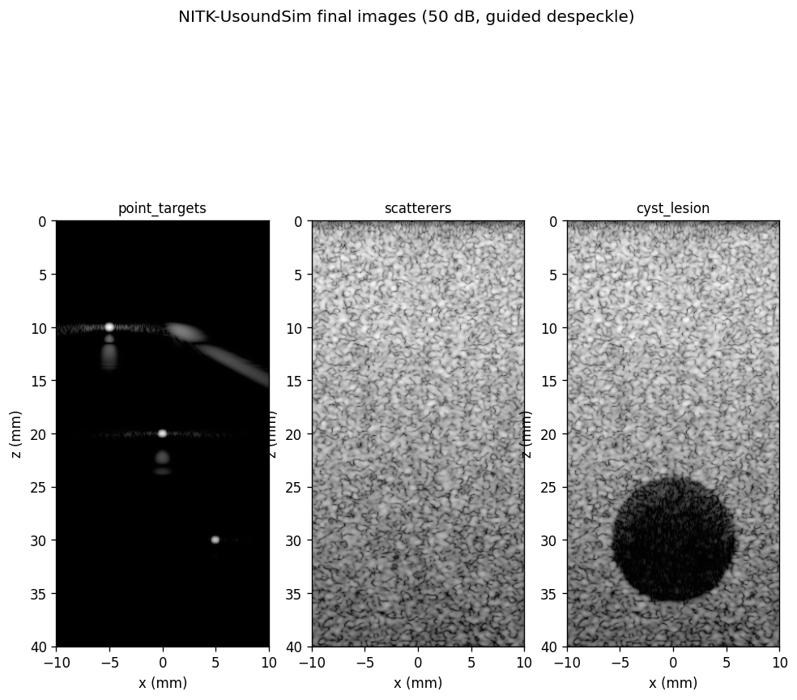
  <br><em>Final output: point targets, speckle, and an anechoic cyst (50 dB dynamic range, guided-filter despeckling).</em>
</p>

---

## Contents
1. [Pipeline at a glance](#1-pipeline-at-a-glance)
2. [Stage by stage: input → process → output](#2-stage-by-stage-input--process--output)
3. [Results](#3-results)
4. [Project structure](#4-project-structure)
5. [How to run](#5-how-to-run)
6. [Tests](#6-tests)
7. [Assumptions and limitations](#7-assumptions-and-limitations)
8. [Documentation](#8-documentation)

---

## 1. Pipeline at a glance

<p align="center">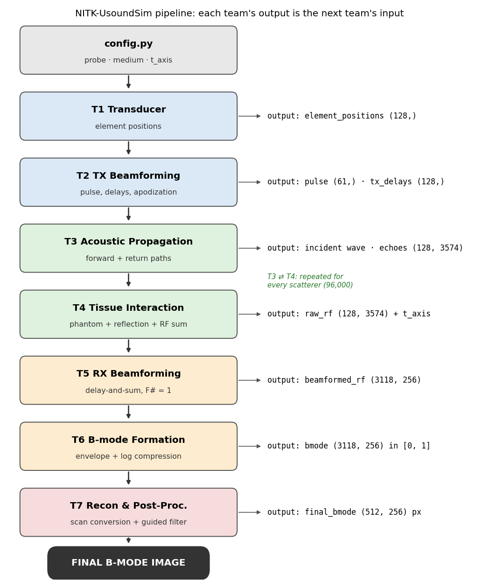</p>

| # | Team | Receives (input) | Produces (output) | Shape / units |
|---|---|---|---|---|
| 0 | Config | — | probe, medium (c = 1540 m/s, fs = 40 MHz, α₀ = 0.5 dB/MHz/cm), `t_axis` | 3574 samples from −0.75 µs |
| 1 | T1 Transducer | `N_ELEMENTS`, `PITCH` | `element_positions` | (128,) m |
| 2 | T2 Transmit Beamforming | `element_positions` | `pulse`, `tx_delays`, apodization, `transmit_field` | (61,), (128,) s, (128,) |
| 3 | T3 Acoustic Propagation | positions, `tx_delays`, `pulse`, scatterer | incident wave at the scatterer, echoes at the elements | (3574,), (128, 3574) |
| 4 | T4 Tissue Interaction + RF | T3 functions, phantom settings | phantom (96,000 scatterers), **`raw_rf`** + `t_axis` | (128, 3574) |
| 5 | T5 Receive Beamforming | `raw_rf`, `t_axis`, positions, scan lines | **`beamformed_rf`** + `z_axis` | (3118, 256) |
| 6 | T6 B-mode Formation | `beamformed_rf` | envelope, **`bmode`** in [0, 1] | (3118, 256) |
| 7 | T7 Image Recon & Post-Processing | `bmode`, scan-line x, `z_axis` | scan-converted `image`, **`final_bmode`** | (512, 256) px, 0.078 mm/px |

The whole chain in code (`simulator/main.py`):

```python
scatterers        = build_phantom(kind)                        # T4
rf, t_axis        = simulate_rf(scatterers)                    # T3 ⇄ T4
beamformed, z     = das_beamform(rf, elements, x_lines, config, t_axis=t_axis)   # T5
bmode             = bmode_formation(beamformed)                # T6
image, x_img, z_img = scan_convert(bmode, x_lines, z)          # T7
final             = postprocess(image)                         # T7
```

---

## 2. Stage by stage: input → process → output

All figures below come from one run of `demo.ipynb` on the **cyst phantom**. No numbers or images are hand-made.

### T1: Transducer
- **Input:** `N_ELEMENTS = 128`, `PITCH = 0.30 mm` (from `config.py`)
- **Process:** places the elements of the linear array, centred on x = 0, at z = 0.
- **Output:** `element_positions` (128,), from −19.05 to +19.05 mm (aperture 38.4 mm).

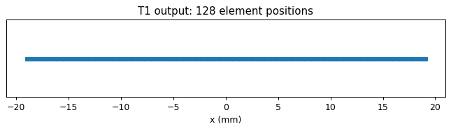

### T2: Transmit Beamforming
- **Input:** `element_positions`, focus depth or steering angle, c.
- **Process:** Gaussian pulse at 8 MHz; per-element delays τₙ = (max d − dₙ)/c; Hann / Hamming / rect apodization.
- **Output:** `pulse` (61,), `tx_delays` (128,) s, apodization (128,), `transmit_field`.
- The imaging chain uses a single **broadcast** transmit (all delays 0). T2's focused delays are tested separately and give **+18.36 dB** at the focus.

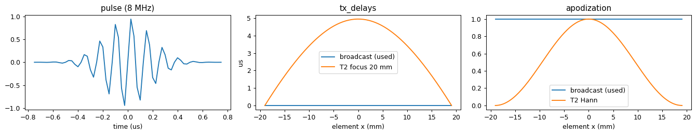
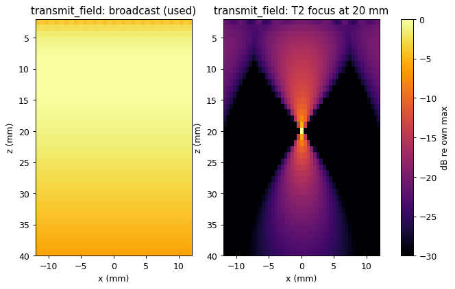

### T3: Acoustic Propagation
- **Input:** element positions, `tx_delays`, `pulse`, scatterer position, `t_axis`.
- **Process:** forward path (array → scatterer) and return path (scatterer → each element); straight rays, attenuation A(d) = 10^(−α₀·f₀·d/20).
- **Output:** `propagated_wavefield` (incident wave, 3574 samples), `travel_times` (128,) = 12.99–17.94 µs for a target at (0, 20) mm, echoes at the elements (128, 3574).

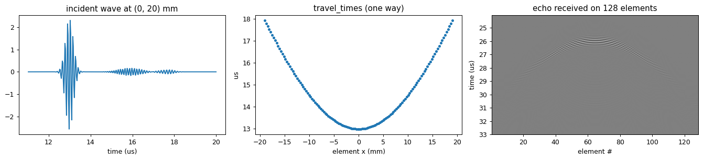

### T4: Tissue Interaction + RF generation
- **Input:** T3's propagation functions, phantom settings (density 1×10⁸ /m², seed 2026).
- **Process:** builds the phantom; at each scatterer scales the incident wave (reflection); adds element directivity sinc(w·sinθ/λ); sums the echoes of all 96,000 scatterers (in parallel on all CPU cores).
- **Output:** **`raw_rf` (128 elements × 3574 samples)** + `t_axis`.

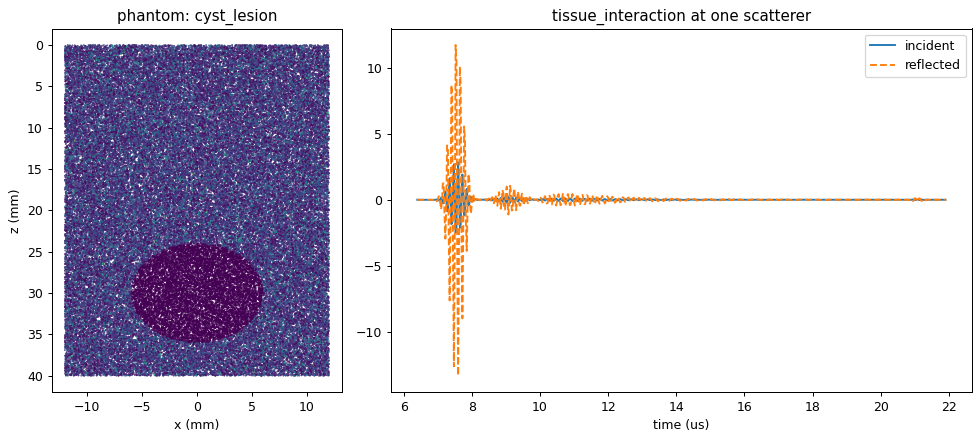
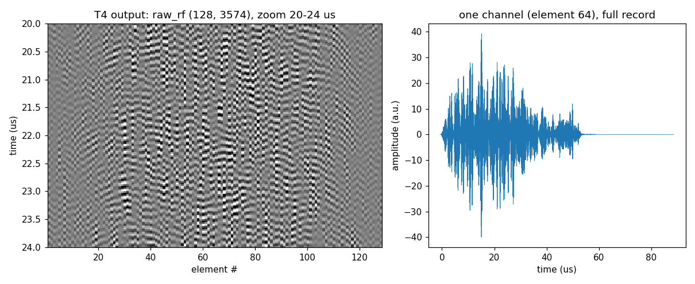

### T5: Receive Beamforming (delay-and-sum)
- **Input:** `raw_rf`, `t_axis`, element positions, 256 scan lines (x = ±10 mm).
- **Process:** for every line and depth: delay τ = τ_TX + τ_RX,m, look up each channel with `np.interp(τ, t_axis, rf)` on the real time axis, Hann-weighted sum over a dynamic aperture (F# = 1).
- **Output:** **`beamformed_rf` (3118 depths × 256 lines)** + `z_axis` (0–60 mm).

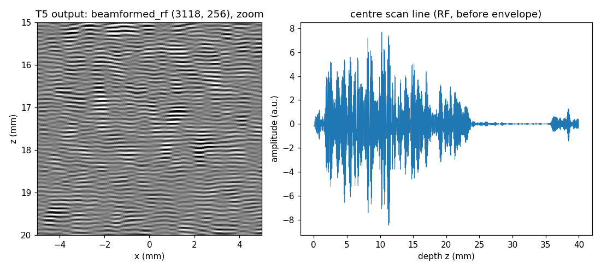

### T6: B-mode Formation
- **Input:** `beamformed_rf`.
- **Process:** envelope E = |Hilbert(RF)|; 20·log₁₀(E / max E); clip to the 50 dB dynamic range; rescale to [0, 1].
- **Output:** **`bmode` (3118 × 256)**, brightness in [0, 1].

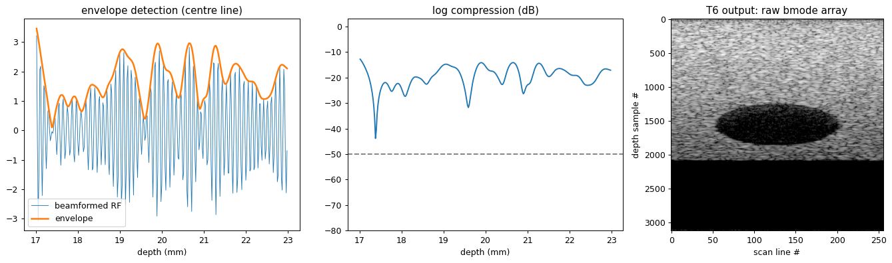

### T7: Image Reconstruction & Post-Processing
- **Input:** `bmode`, scan-line x-positions, `z_axis`.
- **Process:** (1) scan conversion: crop to 0–40 mm, bilinear resample to square pixels; (2) guided-filter despeckling (r = 4, eps = 0.001, from the team's post-processing notebook).
- **Output:** `image` and **`final_bmode` (512 × 256 px, 0.078 mm/px)**.
- Effect on the cyst: speckle index 0.308 → 0.241 while the edge keeps 96 % of its sharpness.

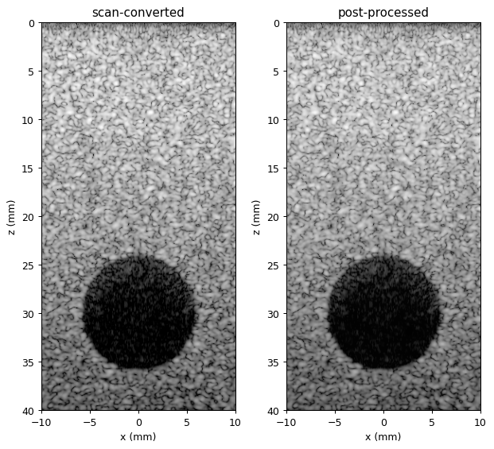
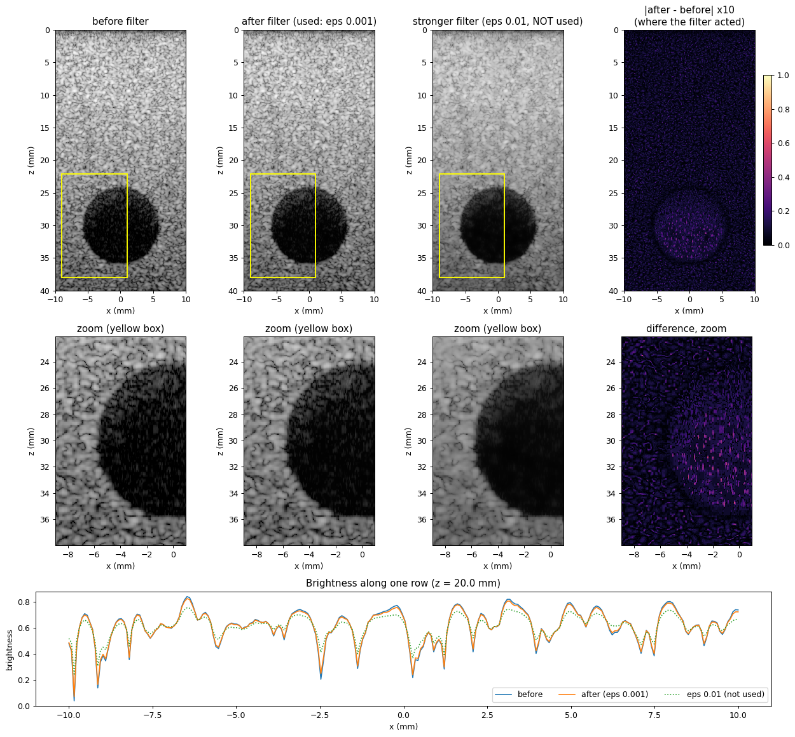

### Final image

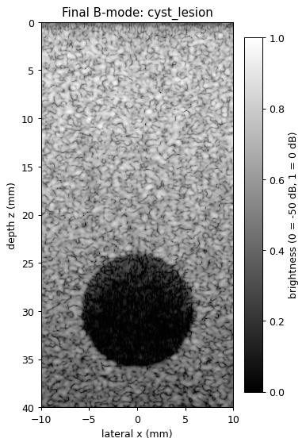

---

## 3. Results

From `python3 simulator/main.py`. Every value was measured by the code.

**Point targets** (resolution and positioning):

| Target (x, z) mm | Measured peak (x, z) mm | Axial / lateral −6 dB width |
|---|---|---|
| (−5, 10) | (−4.98, 10.01) | 0.346 / 0.471 mm |
| (0, 20) | (−0.04, 20.00) | 0.327 / 0.471 mm |
| (+5, 30) | (+4.98, 29.99) | 0.346 / 0.471 mm |

**Speckle:** envelope SNR 1.73–1.92, against 1.91 in theory for fully developed speckle. Brightness is uniform across the image within 0.2 dB.

**Cyst** (anechoic, r = 6 mm at 30 mm depth):

| | Contrast (lesion − ring) | CNR | gCNR | Speckle index |
|---|---|---|---|---|
| Before post-processing | −19.40 dB | 2.323 | 0.860 | 0.308 |
| After guided filter | −19.32 dB | 2.425 | 0.871 | 0.241 |

<p align="center">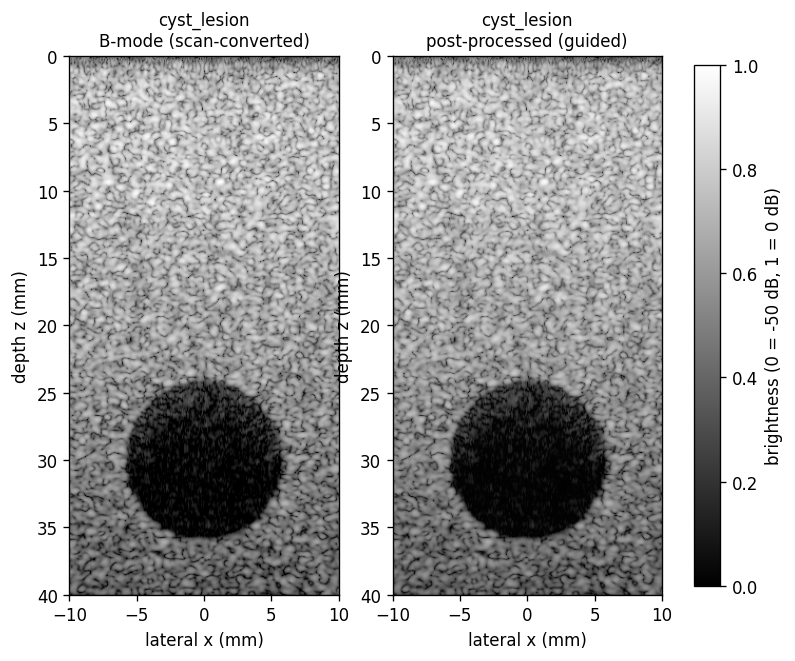 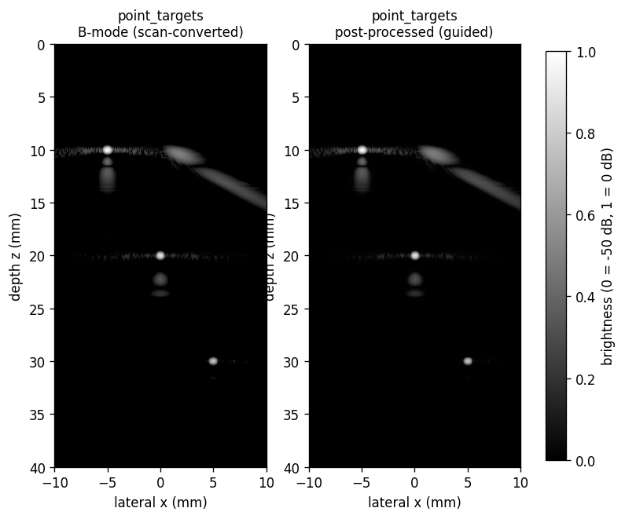</p>

---

## 4. Project structure

```
NITK-UsoundSim/
├── README.md                  ← this file
├── requirements.txt
├── demo.ipynb                 ← ▶ RUN THIS: whole pipeline team by team, with plots
├── demo_colab.ipynb           ← same, for Google Colab (upload zip → Run all)
│
├── simulator/                 ← integration
│   ├── config.py              ← single source of truth (probe, medium, axes)
│   └── main.py                ← end-to-end run: phantom → final image
│
├── teams/                     ← one folder per team: original code + pipeline stage
│   ├── T1_Transducer/                     piezo-material registry (src/)
│   ├── T2_TX_Beamforming/Usound/          transmit delays, apodization, pulse (+ own tests)
│   ├── T3_Acoustic_Propagation/usound_sim/nitk_usoundsim/   propagation engine (+ own tests)
│   ├── T4_Tissue_Interaction/             tissue_interaction.py, phantom.py, tissue_phantoms.py
│   ├── T5_RX_Beamforming/                 receive_beamforming.py, verify_beamformer.py, mock_data.py
│   ├── T6_B_mode/                         bmode_formation.py (+ real carotid notebook)
│   └── T7_Image_Recon_Post_Processing/    post_processing.py (+ post-processing notebook)
│
├── tests/
│   └── parameter_tests.py     ← frequency, attenuation, focus, apodization, sampling
│
├── docs/
│   ├── MODULES.md             ← per-module documentation (inputs, outputs, equations, tests)
│   ├── README.md              ← detailed development log and design decisions
│   ├── NITK-UsoundSim_Project_Flow.pdf   ← input → output handover flow
│   └── images/                ← stage figures used in this README
│
└── results/                   ← final images (.png) and demo.html
```

> Large intermediate arrays (`results/*.npz`, `*.npy`) are not in the repository. `simulator/main.py` re-creates them.

---

## 5. How to run

**Everyone runs one file: `demo.ipynb`.** It runs the whole pipeline step by step (T1 → T7), shows every team's output and plot, and ends with the final B-mode image.

| Where | File | Time |
|---|---|---|
| [A. VS Code](#a-vs-code) | `demo.ipynb` | ≈13 min on an 8-core laptop |
| [B. Google Colab](#b-google-colab) | `demo_colab.ipynb` (the same notebook, set up for Colab) | slower (free tier: 2 CPUs) |
| [C. Only view the output](#c-only-view-the-output) | `results/demo.html` | instant |

### A. VS Code

**1. Install (once)**
- **Python 3.12** (recommended): [download Python 3.12](https://www.python.org/downloads/release/python-3124/). The project was developed and tested on **Python 3.12.4**, so use 3.12 if you can.
  - On Windows, tick **"Add python.exe to PATH"** in the installer.
  - If you already have several Pythons, install the libraries into 3.12 and pick 3.12 as the kernel (step 4).
- [VS Code](https://code.visualstudio.com/) with the **Python** and **Jupyter** extensions (Microsoft)

**2. Get the project.** Either use **Code → Download ZIP** on this page and unzip it, or clone it:
```bash
git clone https://github.com/darshilgmaniya/NITK-UsoundSim.git
```

**3. Install the libraries.** In VS Code, choose **File → Open Folder…** and open the project folder (the one containing `demo.ipynb`). Open a terminal with **Terminal → New Terminal** and run:
```bash
python3 -m pip install -r requirements.txt
```
On Windows, use `py -3.12 -m pip install -r requirements.txt`. On Mac or Linux, if `python3` is not 3.12, use `python3.12 -m pip install -r requirements.txt`.

<sub>Tested versions: Python 3.12.4, numpy 1.26.4, scipy 1.16.0, matplotlib 3.8.3, opencv-python 4.9.0.</sub>

**4. Run `demo.ipynb`.**
1. Open `demo.ipynb`.
2. Click **Select Kernel** (top right) → **Python Environments** → choose **Python 3.12**, the one you installed the libraries into.
3. Click **Run All**.

Each team's section runs in order and shows its output. The **final image** appears at the end.

> **`No module named 'cv2'`?** The notebook is using a different Python. Click the kernel name (top right), choose the Python from step 3, and click **Run All** again.

### B. Google Colab

[](https://colab.research.google.com/github/darshilgmaniya/NITK-UsoundSim/blob/main/demo_colab.ipynb)

1. Click **Open in Colab** above.
2. Choose **Runtime → Run all**. If Colab warns that the notebook is not authored by Google, choose **Run anyway**.
3. The first cell downloads the project automatically. The final image appears in the last cell.

Keep the tab open until the run finishes. If the runtime disconnects, run all cells again.

### C. Only view the output

Download [`results/demo.html`](results/demo.html) and open it in any browser. It is the already-executed notebook, with every stage's output and image.

---

## 6. Tests

| Test | Command | Result |
|---|---|---|
| T5 beamformer verification (4 tests) | `PYTHONPATH=simulator python3 teams/T5_RX_Beamforming/verify_beamformer.py` | 4/4 pass (position errors 0.008–0.040 mm) |
| Parameter tests (9 checks) | `python3 tests/parameter_tests.py` | 9/9 pass |
| T3 propagation suite | T3's own tests | 22/22 pass |
| T2 transmit beamforming | T2's own tests | 2/2 pass |

Parameter test highlights:

| Parameter | Values | Measured |
|---|---|---|
| Centre frequency | 4 / 8 / 12 MHz | axial width 0.674 / 0.327 / 0.212 mm (theory 0.680 / 0.340 / 0.227) |
| Attenuation | α₀ = 0.5 / 1.0 dB/MHz/cm | −16.11 / −32.21 dB (theory −16 / −32) |
| TX focus (T2) | focus at 20 mm | +18.36 dB at the target |
| RX apodization | rect / Hamming / Hann | sidelobes −18.2 / −33.3 / −32.7 dB |
| Sampling rate | 32 / 64 / 128 MHz | target position unchanged (within one sample) |

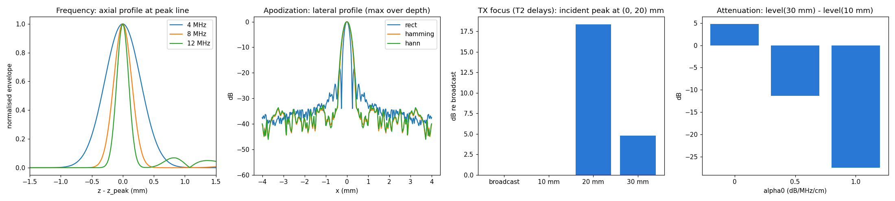

---

## 7. Assumptions and limitations

- **Probe:** Philips publishes 128 elements and 4–12 MHz. The 0.30 mm pitch and 8 MHz centre frequency are T2's documented assumptions.
- **2-D, linear model:** straight rays, constant speed of sound, point scatterers, no elevation, no nonlinear propagation.
- **Single broadcast transmit** is reused for all 256 lines. Per-line focusing would need 256 separate simulations.
- **No TGC:** at 8 MHz the image is about 17 dB darker at 36–40 mm than at 8–12 mm.
- **Artefacts:** a faint −25 dB diagonal arc remains next to the shallow point target. It is documented but not root-caused.
- **Phantoms, not organs:** the simulator images synthetic phantoms (point targets, speckle, cyst), not real anatomy.

---

## 8. Documentation

| Document | Content |
|---|---|
| [`docs/MODULES.md`](docs/MODULES.md) | For each module: explanation, inputs, outputs, equations, algorithm, assumptions, limitations, test result |
| [`docs/NITK-UsoundSim_Project_Flow.pdf`](docs/NITK-UsoundSim_Project_Flow.pdf) | Visual flow of which output becomes which team's input |
| [`docs/README.md`](docs/README.md) | Full development log: design decisions, bugs found and fixed, probe update (64 → 128 elements) |
| [`demo.ipynb`](demo.ipynb) | Runnable walkthrough of every stage |

---

**Teams:** T1 Transducer · T2 Transmit Beamforming · T3 Acoustic Propagation · T4 Tissue Interaction · T5 Receive Beamforming · T6 B-mode Formation · T7 Image Reconstruction & Post-Processing (262SP009, Darshil Maniya).
NITK Surathkal, 2026.
